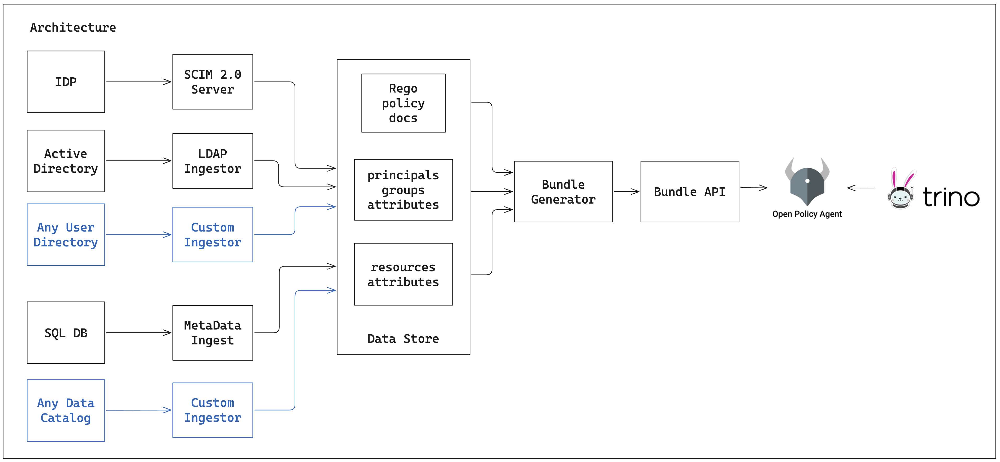

# Moat
**Moat makes OPA + Trino easy**

## Architecture

OPA and Trino are an awesome combination, but maintaining the policy documents and required data object
can be painful. Moat makes this easy with managed curation of principals and tables,
as well as a predefined set of ABAC policies suitable for most uses

Moat provides an API to serve bundles to OPA, including:

* Data objects and attributes ingested from various sources (SQL DBs,data catalogs etc)
* Principals and attributes/groups ingested from identity providers (SQL DB, LDAP, etc)
* Pre-built `rego` policy documents to support common use cases (e.g. RBAC/ABAC)

Read more about how [Trino and OPA](trino_and_opa.md) work together

## Extensability
Moat is built to be extended. [Custom connectors](extensions.md) can be added easily to retrieve data from a wide range of sources, such as:

* **IDPs:** e.g. Keycloak, IdentityNow, Auth0
* **User Directories** e.g Azure AD, OpenLDAP
* **Data Catalogs:** e.g. Amundsen, OpenMetadata, Datahub
* **Databases:** e.g. MongoDB, DynamoDB, SQL DBs
* **File Sources:** e.g. json, yaml, csv
* **API Sources:** e.g. Custom Identity Providers

## Motivation
In late 2023 [Open Policy Agent (OPA)](https://www.openpolicyagent.org/) was introduced into Trino as an [authentication method](https://trino.io/docs/current/security/opa-access-control.html).
OPA is a very powerful policy enforcement engine which helps to solve many authorisation issues with the previously available 
authorisation options in Trino. 

OPA provides the capability to implement very fine-grained R/ABAC policies to control access to data in Trino. OPA
policies can control access at the catalog, schema, table or column level and provide column masking. 

OPA policies are defined in a language called Rego. While it is an expressive and powerful language, it has a steep
learning curve and limits policy definition to users with software development skills. It is expected that users within 
many organisations who are tasked with data policy definition do not possess these types of skills.

OPA also requires context on the principals and objects, such as attributes or group mappings. This must be provided to OPA
as a (possibly) large JSON object, and updated whenever these values change.  

While extremely powerful, OPA is hard to use for non-developers, and has a significant integration cost. 

**Permitta simplifies the use of OPA with Trino by:**

* Aggregating metadata from sources such as `Active Directory`
* Delivering bundles of policy and context metadata to instances of OPA

